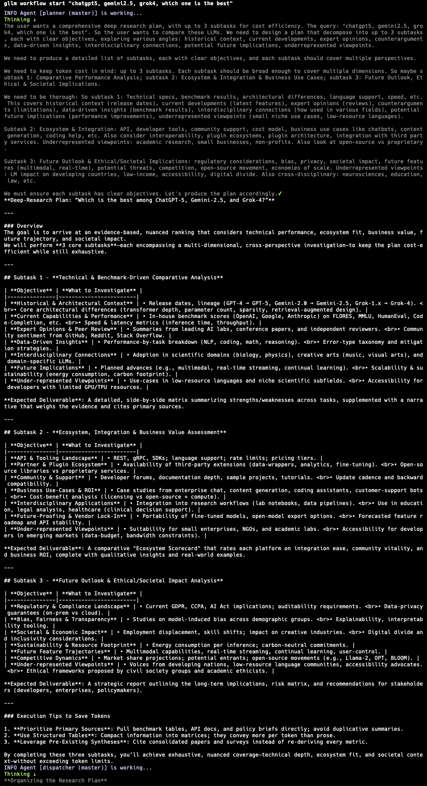
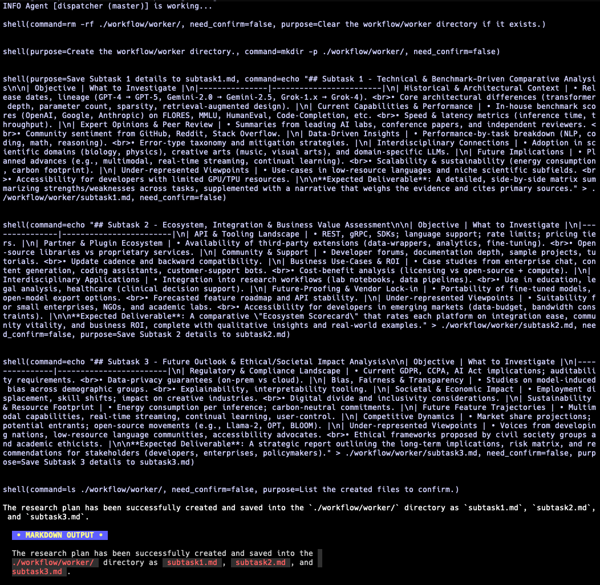
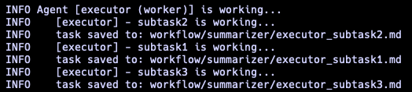
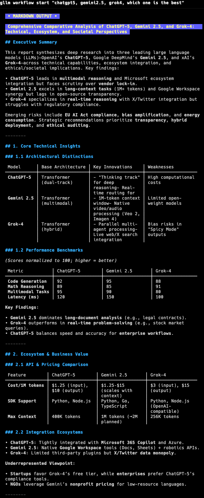

# gllm - Golang Command-Line LLM Companion

`gllm` is a powerful CLI tool designed to interact seamlessly with various Large Language Models (LLMs). It supports features like interactive chat, multi-turn conversations, file attachments, search integration, a command agent, multi-agent workflows, deep research, mcp services and extensive customization.

## 🚀 Features

- **Flexible Model Selection**: Easily configure and switch between different LLMs.
- **Interactive Chat Mode**: Start real-time conversations with AI models.
- **Editor Integration**: Use your preferred text editor for comfortable multi-line input in chat mode.
- **Prompt Templates & System Prompts**: Manage reusable prompts and instructions.
- **Attachment Support**: Process files, images, and URLs as part of your queries.
- **Search Integration**: Use search engines to find the latest and most relevant information.
- **Web Retrieval**: Extract comprehensive text content from URLs, including websites, raw text files, and PDF documents.
- **PDF & Image Processing**: Supports processing of PDF documents and images with capable models.
- **Reasoning & Deep Thinking**: Generate detailed explanations, logical breakdowns, and step-by-step analysis.
- **Markdown Support**: Renders Markdown for easy-to-read formatted output.
- **Multi-turn Conversations**: Engage in multiple rounds of conversation and manage chat history.
- **Command Agent Mode**: Let LLMs plan and execute commands with your confirmation.
- **Multi-Agent Workflows**: Build and run complex workflows with multiple agents for tasks like deep research.
- **Model Context Protocol (MCP) Support**: Connect to external MCP servers to access additional tools and data sources.
- **Token Usage Tracking**: Monitor your token consumption.
- **Configuration Management**: Easily manage models, templates, system prompts, and search engines.
- **Agent Management**: Create, configure, and switch between different AI assistant profiles with custom models, tools, and settings.
- **Memory Management**: Remember important facts about you across sessions for personalized responses.
- **@ Reference Support**: Reference files and directories directly in prompts using @ syntax for seamless context inclusion.
- **Version Control**: Easily track and update your `gllm` setup.

---

## 📌 Installation

### Homebrew (macOS)

```sh
brew tap activebook/gllm
brew install gllm --cask
```

```sh
brew update
brew upgrade gllm --cask
```

### Scoop (Windows)

```sh
scoop bucket add gllm https://github.com/activebook/scoop-gllm.git
scoop install gllm
```

### Shell (Alpine Linux/Ubuntu/CentOS/MacOS)

```sh
curl -fsSL https://raw.githubusercontent.com/activebook/gllm/main/build/install.sh | sh
```

### Build from Source

```sh
git clone https://github.com/activebook/gllm.git
cd gllm
go build -o gllm
```

#### eg. Run on Alpine Linux

| Run on Linux | MCP Run on Linux |
|--------------|------------------|
|  |  |

---

## 💡 Initialization

The easiest way to get started is to run the interactive initialization wizard:

```sh
gllm init
```

This will guide you through setting up your preferred LLM provider, API keys, and default settings.

## 🎯 Usage

### Basic Commands

- **Ask a simple question:**

  ```sh
  gllm "What is Go?"
  ```

- **Use a specific model:**

  ```sh
  gllm "Where is the best place to visit in London?" -m gpt4o
  ```

- **Use a template for a specific task:**

  ```sh
  gllm "How to find a process and terminate it?" -p shellmate
  ```

- **Search the web:**

  ```sh
  gllm "Who is the current POTUS?" -s
  ```

  

- **Reference files in prompts:**

  ```sh
  gllm "Give me an overview of the project structure: @cmd/ and @service/"
  gllm "I'm considering refactoring this code. Analyze the current structure and suggest improvements: @service/agent.go @service/openai.go"
  gllm "Document this new feature based on the code: @service/atref.go and @test/test_atref.go"
  ```

### Interactive Chat

Start an interactive chat session:

```sh
gllm chat
```


Within the chat, you can use various commands:

- `/help`: Show available commands.
- `/history`: View conversation history.
- `/system <prompt>`: Change the system prompt.
- `/attach <file>`: Attach a file to the conversation.
- `! <command>`: Execute a shell command.

### Multi-Line Input with Editor

For longer messages or code snippets, use your preferred text editor directly in chat mode:

```sh
# In chat mode, type:
/editor
/e
```

#### ✨ In chat mode, you can copy/paste text/code

**How to use:**

1. Open prefered editor
2. Compose your message
3. Save and exit the editor
4. Review the content in gllm
5. Press Enter to send or Ctrl+C to discard

**Setup your editor:**

```sh
# Set your preferred editor (vim, nano, code, etc.)
gllm editor vim

# List available editors
gllm editor list

# Check current editor
gllm editor
```

### Multi-turn Conversations

There are two main ways to have a multi-turn conversation:

#### 1. Single-Line Style (using named conversations)

You can maintain a conversation across multiple commands by assigning a name to your conversation with the `-c` flag. This is useful for scripting or when you want to continue a specific line of inquiry.

- **Start or continue a named conversation:**

  ```sh
  gllm "Who's the POTUS right now?" -c my_convo
  gllm "Tell me more about his policies." -c my_convo
  ```

#### 2. Chat Style (interactive session)

For a more interactive experience, you can use the `chat` command to enter a real-time chat session.

- **Start an interactive chat session:**

  ```sh
  gllm chat
  ```

  Within the chat, the conversation history is automatically maintained.

---

## Memory Management

`gllm` can remember important facts about you across sessions, making conversations more personalized and contextual.

### Memory Commands

```sh
gllm memory
gllm memory add "I prefer Go over Python"
gllm memory list
gllm memory clear --force  # Skip confirmation
gllm memory path
```

### How Memory Works in Conversations

Memories are automatically injected into the system prompt, so the LLM will remember your preferences and context across all conversations:

**Example:**

```sh
# Start a conversation - the LLM will automatically consider your memories
$ gllm chat
> Remember this: I work primarily with Go and Docker
> Forget this: I love dark jokes
```

You can manually edit this file or use the `gllm memory path` command to find it.

---

### File Attachments

- **Summarize a text file:**

  ```sh
  gllm "Summarize this" -a report.txt
  ```

- **Analyze an image:**

  ```sh
  gllm "What is in this image?" -a image.png
  ```

- **Process a PDF document (with a capable model like Gemini):**

  ```sh
  gllm "Summarize this PDF" -a document.pdf
  ```

### Code Editing

The command agent supports diff editing for precise code modifications.

```sh
gllm "Read this file @build.sh and change function name"
```

| Edit code with diff | Cancel an edit |
|:-------------------:|:--------------:|
|  |  |

### Workflows

`gllm` allows you to define and run complex workflows with multiple agents. A workflow consists of a sequence of agents, where the output of one agent serves as the input for the next. This is useful for tasks like deep research, automated code generation, and more.

#### How it Works

A workflow is defined by a series of agents, each with a specific role and configuration. There are two types of agents:

- **`master`**: A master agent orchestrates the workflow. It takes an initial prompt and its output is passed to the next agent in the sequence. A workflow must have at least one master agent.
- **`worker`**: A worker agent performs a specific task. It receives input from the previous agent, processes it, and its output is passed to the next agent.

When a workflow is executed, `gllm` processes each agent in the defined order. The output from one agent is written to a directory that becomes the input for the next agent.

#### Workflow Commands

You can manage your workflows using the `gllm workflow` command:

- **`gllm workflow list`**: List all agents in the current workflow.
- **`gllm workflow add`**: Add a new agent to the workflow.
- **`gllm workflow remove`**: Remove an agent from the workflow.
- **`gllm workflow set`**: Modify the properties of an existing agent.
- **`gllm workflow move`**: Change the order of agents in the workflow.
- **`gllm workflow info`**: Display detailed information about a specific agent.
- **`gllm workflow start`**: Execute the workflow.

#### Example: A Simple Research Workflow

Here's an example of a simple research workflow with two agents: a `planner` and a `researcher`.

**Planner (master)**: This agent takes a research topic and creates a research plan.
**Researcher (worker)**: This agent takes the research plan and executes it, gathering information and generating a report.

To create this workflow, you would use the `gllm workflow add` command:

```sh
# Add the planner agent
gllm workflow add --name planner --model groq-oss --role master --output "workflow/planner" --template "Create a research plan for the following topic: {{.prompt}}"

# Add the researcher agent
gllm workflow add --name researcher --model gemini-pro --role worker --input "workflow/planner" --output "workflow/researcher" --template "Execute the following research plan: {{.prompt}}"
```

To execute the workflow, you would use the `gllm workflow start` command:

```sh
gllm workflow start "The future of artificial intelligence"
```

This will start the workflow. The `planner` agent will create a research plan and save it to the `workflow/planner` directory. The `researcher` agent will then read the plan from that directory, execute the research, and save the final report to the `workflow/researcher` directory.

Here's an example of a deep research workflow in action:

| Planner | Dispatcher | Workers | Summarizer |
|---------|------------|---------|------------|
| Designs a plan for the research.   | Dispatches sub-tasks to worker agents.   | Execute the sub-tasks in parallel.   | Summarizes the results from the workers to provide a final report.   |

---

## 🤖 Agent Management

Create and manage multiple AI assistant profiles with different configurations:

```sh
# Create agents for different tasks
gllm agent add coder --model gpt-4o --tools on
gllm agent add researcher --model gemini-pro --search google

# Switch between agents
gllm agent switch coder
gllm agent switch researcher

# List and manage agents
gllm agent list
gllm agent info coder
gllm agent set coder --model gpt-4
```

**Agent Commands:**

- `gllm agent add <name>` - Create a new agent
- `gllm agent list` - List all agents
- `gllm agent switch <name>` - Switch to an agent
- `gllm agent info <name>` - Show agent details
- `gllm agent set <name>` - Update an agent
- `gllm agent remove <name>` - Delete an agent

---

## 🛠 Model Context Protocol (MCP)

`gllm` supports the Model Context Protocol (MCP), allowing you to connect to external MCP servers to access additional tools and data sources. This enables LLMs to interact with external services, databases, and APIs through standardized protocols.

### Enabling/Disabling MCP

- **Enable MCP:**

  ```sh
  gllm mcp on
  ```

- **Disable MCP:**

  ```sh
  gllm mcp off
  ```

- **Check MCP status:**

  ```sh
  gllm mcp
  ```

### Managing MCP Servers

You can add, configure, and manage MCP servers of different types:

- **Add an MCP server:**

  ```sh
  # Add a stdio-based server
  gllm mcp add --name my-server --type std --command "my-mcp-server"

  # Add an SSE-based server
  gllm mcp add --name sse-server --type sse --url "http://example.com/mcp"

  # Add an HTTP-based server
  gllm mcp add --name http-server --type http --url "http://example.com/mcp"
  ```

- **List available MCP tools:**

  ```sh
  gllm mcp list
  ```

  

- **Update an MCP server:**

  ```sh
  gllm mcp set --name my-server --allow true
  ```

- **Remove an MCP server:**

  ```sh
  gllm mcp remove --name my-server
  ```

- **Export/Import MCP servers:**

  ```sh
  gllm mcp export [path]
  gllm mcp import [path]
  ```

### Using MCP in Queries

Once MCP is enabled and servers are configured, the LLM can automatically use available MCP tools during conversations:

```sh
gllm "Use the available tools to fetch the latest info of golang version"
```


The LLM will detect relevant MCP tools and use them to enhance its responses with external data and capabilities.

---

## 🛠 Configuration

`gllm` stores its configuration in a user-specific directory. You can manage the configuration using the `config` command.

- **Show the configuration file path:**

  ```sh
  gllm config path
  ```

- **Print all configurations:**

  ```sh
  gllm config print
  ```

- **Export/Import the configuration file:**

  ```sh
  gllm config export [directory]
  gllm config import [directory]
  ```

- **Manage models, templates, system prompts, and search engines:**

  ```sh
  gllm model --help
  gllm template --help
  gllm system --help
  gllm search --help
  ```

---

## 🏗 Contributing

Contributions are welcome! Please feel free to submit a pull request or open an issue.

---

*Created by Charles Liu ([@activebook](https://github.com/activebook))*
