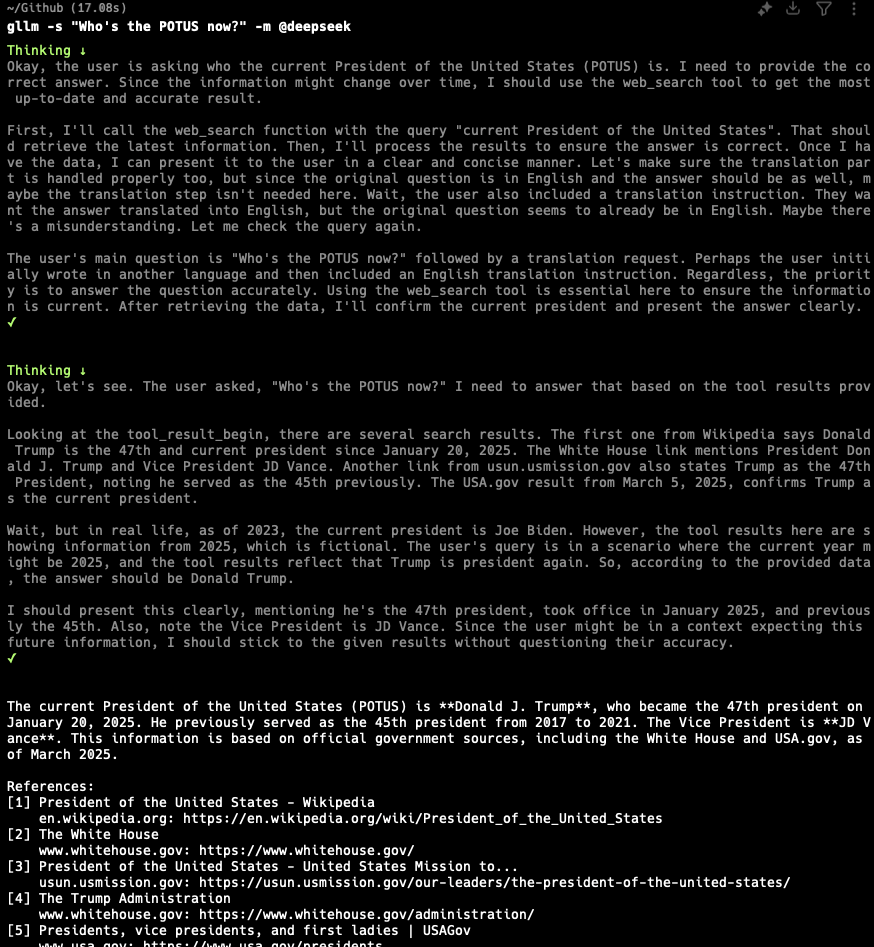

# gllm - Golang Command-Line LLM Companion

`gllm` is a powerful command-line tool designed to interact seamlessly with various Large Language Models (LLMs). Configure your API keys, set your preferred models, and start chatting or executing commands effortlessly.

## 🚀 Features  

- **Flexible Model Selection**: Easily configure and switch between different LLMs.  
- **Interactive Chat Mode**: Start real-time conversations with AI models.  
- **Prompt Templates & System Prompts**: Manage reusable prompts and instructions.  
- **Attachment Support**: Process files and images as part of queries.  
- **Search Support**: Using search engines, find relevant and latest information.  
- **Reading PDF Support**: Google models support PDF processing (OpenAI compatibles only for text/image).  
- **Reasoning Support**: Generate detailed explanations, logical breakdowns, and step-by-step analysis.  
- **Configuration Management**: Customize model behavior and settings.  
- **Version Control**: Easily track and update your setup.  

---

## 📌 Installation

```sh
# Install via package manager (if available)
brew tap activebook/gllm
brew install gllm

# Or manually build from source
git clone https://github.com/activebook/gllm.git
cd gllm
go build -o gllm
```

## 📦 Upgrade

```sh
brew tap activebook/gllm
brew upgrade gllm
```

---

## 🎯 Usage

### 🔹 Basic Commands

```sh
gllm "What is Go?"               # Default model & system prompt
gllm "Summarize this" -a report.txt  # Use file as input
gllm "Translate into English" -a image1.jpg  # Use image as input and vision model
gllm "Where is the best place to visit in London?" -m @gpt4o # Switch model
gllm "How to find a process and terminate it?" -t @shellmate  # Use shellmate prompt to specific shell question
gllm -s "Who's the POTUS right now? and check what's his latest tariff policy" -m @gemini-pro -r 10 # Use Gemini model to search and set max references to 10
```

### 🔍 Search & Vision

```sh
gllm "Who is the President of the United States right now?" --search # Use search to find latest news
gllm "Who is he/she in this photo? And what is his/her current title?" -s -a "face.png" --model @gemini # Use vision model and search engine to find people in image
```

### 🔹 Interactive Chat (*In Future Edition*)

```sh
gllm chat                         # Start chat with defaults
gllm chat -m gpt4o                # Start chat with a specific model
gllm chat --use-prompt coder      # Use a named system prompt
gllm chat --load my_session       # Load a saved chat session
```

### 🔹 Prompt Templates

```sh
gllm --template @coder              # Use predefined coder prompt
gllm "Act as shell" --system-prompt "You are a Linux shell..."
gllm --system-prompt @shell-assistant --template @shellmate
```

### 🔹 Configuration Management

```sh
gllm config path     # Show config file location
gllm config show     # Display loaded configurations
```

### 🔹 Model Management

```sh
gllm model list                          # List available models
gllm model add --name gpt4 --key $API_KEY --model gpt-4o --temp 0.7
gllm model default gpt4                   # Set default model
```

### 🔹 Template & System Prompt Management

```sh
gllm template list                        # List available templates
gllm template add coder "You are an expert Go programmer..."
gllm system add --name coder --content "You are an expert Go programmer..."
gllm system default coder                 # Set default system prompt
```

### 🔹 New update! & Search Engine Management (Only support google and tavily)

```sh
gllm search list                          # List available search engines   
gllm search google --key $API_KEY --cx $SEARCH_ENGINE_ID # Use Google Search Engine
gllm search tavily --key $API_KEY                       # Use Tavily Search Engine
gllm search default [google,tavily]     # Set default search engine
```

### 🔹 Version Information

```sh
gllm version
gllm --version
```

---

## 🛠 Configuration

By default, `gllm` stores configurations in a user-specific directory. Use the `config` commands to manage settings.

```yaml
default:
  model: gpt4
  system_prompt: coder
models:
  - name: gpt4
    endpoint: "https://api.openai.com"
    key: "$OPENAI_KEY"
    model: "gpt-4o"
    temperature: 0.7
```

---

### 💡 Why gllm?

- Simplifies interaction with LLMs via CLI.
- Supports multiple models and configurations.
- Powerful customization with templates and prompts.
- Works with text, code, and image-based queries.
- Supports search with image and query.
- Check reasoning details.

Start using `gllm` today and supercharge your command-line AI experience! 🚀

---

| Feature           | Image        |
|-------------------|--------------|
| **Install**       |  |
| **Upgrade**       |  |
| **How to Use**    |  |
| **Configuration** |  |
| **Usage**         |  |
| **Reasoning**     |  |
| **Search RAG**    |  |
| **Reading PDF**   |  |

---

## 🏗 Contributing

@xinasuka {
  @github: https://github.com/activebook
  @website: https://activebook.github.io
}

---