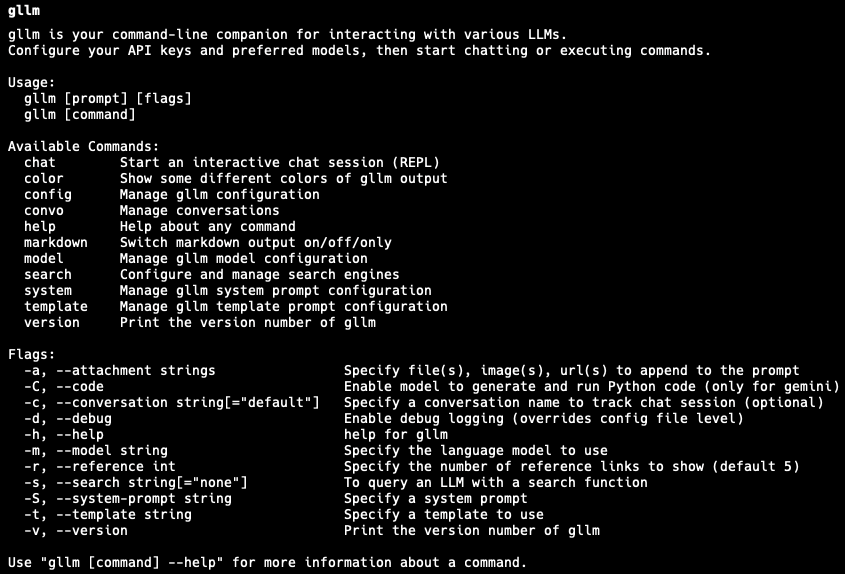
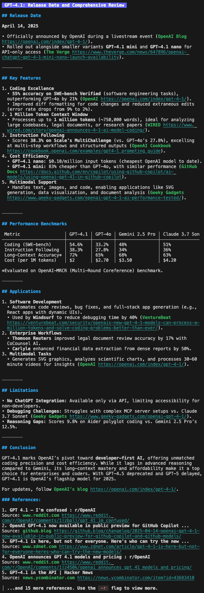

# gllm - Golang Command-Line LLM Companion

`gllm` is a powerful command-line tool designed to interact seamlessly with various Large Language Models (LLMs). Supports features like interactive chat, multi-turn conversations, file attachments, search integration, and extensive customization.

## 🚀 Features  

- **Flexible Model Selection**: Easily configure and switch between different LLMs.  
- **Interactive Chat Mode**: Start real-time conversations with AI models.  
- **Prompt Templates & System Prompts**: Manage reusable prompts and instructions.  
- **Attachment Support**: Process files and images as part of queries.  
- **Search Support**: Using search engines, find relevant and latest information.  
- **Reading PDF Support**: Google models support PDF processing (OpenAI compatibles only for text/image).  
- **Reasoning Support**: Generate detailed explanations, logical breakdowns, and step-by-step analysis.  
- **Markdown Support**: Format Markdown contents and make it easier to read.
- **Multi-turn Chat**: Engage in multiple rounds of conversation.  
- **Check out history and context**: In chat mode or multi-turn chat, easily view the full context.
- **Configuration Management**: Customize model behavior and settings.  
- **Version Control**: Easily track and update your setup.  

---

## 📌 Installation

```sh
# Install via package manager (if available)
brew tap activebook/gllm
brew install gllm

# Or manually build from source
git clone https://github.com/activebook/gllm.git
cd gllm
go build -o gllm
```

## 📦 Upgrade

```sh
brew tap activebook/gllm
brew upgrade gllm
```

---

## 🎯 Usage

### 🔹 Basic Commands

```sh
gllm "What is Go?"               # Default model & system prompt
gllm "Where is the best place to visit in London?" -m @gpt4o # Switch model
gllm "How to find a process and terminate it?" -t @shellmate  # Use shellmate prompt to specific shell question
gllm -s "Who's the POTUS right now? and check what's his latest tariff policy" -m @gemini-pro -r 10 # Use Gemini model to search and set max references to 10
```

### 🔹 Attachments (Files, Image, Urls)

```sh
gllm "Summarize this" -a report.txt  # Use file as input
gllm "Translate into English" -a image1.jpg  # Use image as input and vision model
gllm "Summarize all:" -a "https://www.cnbc.com" -a "https://www.nytimes.com" # Attach multiple urls
gllm "Transcribe this audio" -a speech.mp3  # Use audil as input (only for gemini multimodal models)
```

### 🔍 Search & Vision

```sh
gllm "Who is the President of the United States right now?" --search # Use search to find latest news
gllm "Who is he/she in this photo? And what is his/her current title?" -s -a "face.png" --model @gemini # Use vision model and search engine to find people in image
gllm "When was gpt4.5 released?" --search=google # Use specific search engine to find latest news
```

### 💬 Keep Conversations (Multi-turn chat)

```sh
gllm -s "Who's the POTUS right now?" -c      # Start a conversation(default without name) and retain the full context (last 10 messages)
gllm "Tell me again, who's the POTUS right now?" -c   # Continue the default conversation
gllm "Let's talk about why we exist." -c=newtalk      # Start a new named conversation called 'newtalk'
gllm -s "Look up what famous people have said about this." -c=newtalk  # Continue the 'newtalk' conversation
```

⚠️ Warning: If you're using **Gemini mode** and an **OpenAI-compatible model**, keep in mind that they **cannot be used within the same conversation**.  
These models handle chat messages differently, and mixing them will lead to unexpected behavior.

### 🖥️ >> Interactive Chat (**Available!**)

```sh
gllm chat                       # Start chat with defaults
gllm chat -m @gpt4o             # Start chat with a specific model
gllm chat --sys-prompt coder    # Use a named system prompt
gllm chat -c my_chat            # Start a new chat session
gllm chat -c=1                  # Follow a previous chat session with a convo index
gllm chat -s                    # Start a new conversation with search
```

#### 🛠️ You can change setting in the chat session

```sh
gllm> /exit, /quit    # Exit the chat session
gllm> /clear, /reset  # Clear context
gllm> /help           # Show available commands
gllm> /history /h [num] [chars]   # Show recent conversation history (default: 20 messages, 200 chars)
gllm> /markdown, /mark [on|off|only]  # Switch whether to render markdown or not
gllm> /system, /S [@name|prompt]  # change system prompt
gllm> /template, /t [@name|tmpl]  # change template
gllm> /search, /s [search_engine] # select a search engine to use
gllm> /reference. /r [num]        # change link reference count
gllm> /attach, /a [filename]      # Attach a file to the chat session
gllm> /detach, /d [filename|all]  # Detach a file to the chat session
```

⚠️ Warning: You can't switch models within the same conversation. Once you choose a model, you'll need to stick with it throughout. Just like when using different models online, you can continue or change topics, you can do search and attach files, but **the model type remains the same**.

### 🔹 Prompt Templates

```sh
gllm --template @coder              # Use predefined coder prompt
gllm "Act as shell" --system-prompt "You are a Linux shell..."
gllm --system-prompt @shell-assistant --template @shellmate
```

### 🔹 Configuration Management

```sh
gllm config path     # Show config file location
gllm config show     # Display loaded configurations
```

### 🔹 Model Management

```sh
gllm model list                          # List available models
gllm model add --name gpt4 --key $API_KEY --model gpt-4o --temp 0.7
gllm model default gpt4                   # Set default model
```

### 🔹 Template & System Prompt Management

```sh
gllm template list                        # List available templates
gllm template add coder "You are an expert Go programmer..."
gllm system add --name coder --content "You are an expert Go programmer..."
gllm system default coder                 # Set default system prompt
```

### 🔹 New update! & Search Engine Management

```sh
gllm search list                          # List available search engines   
gllm search google --key $API_KEY --cx $SEARCH_ENGINE_ID # Use Google Search Engine
gllm search tavily --key $API_KEY                       # Use Tavily Search Engine
gllm search default [google,tavily]     # Set default search engine
gllm search save [on|off]         # Save search results on conversation history (careful! could induce token consumption. default: off)
```

### 🔹 New update! & Conversation Management

```sh
gllm convo list            # list all conversations
gllm convo remove newtalk  # remove a conversation
gllm convo remove "chat_*" # wildcard remove multiple conversations
gllm convo info newtalk    # show a conversation in details
gllm convo info 1          # use index to view a conversation in details
gllm convo info newtalk -n 100 -c 300 # view history context (the lastest 100 messages, 300 characters each)
gllm convo clear           # clear all conversations
```

### 🔹 New update! & Markdown output Management

```sh
gllm markdown on            # enable markdown output which append the end of the streaming contents
gllm markdown off           # disable markdown output
gllm markdown only          # only render markdown output
```

### 🔹 Std input Support

```sh
cat script.py | gllm "Help me fix bugs in this python coding snippet:" -a - # Use std input as file attachment
cat image.png | gllm "What is this image about?" -a - # Use std input as image attachment
cat jap.txt | gllm "Translate all this into English" # Use std input as text input
cat report.txt | gllm "Summarize this"
echo "What is the capital of France?" | gllm # Use std input as text input
echo "Who's the POTUS right now?" | gllm -s # Use std input as search query
```

### 🔹 Python code execution (only for gemini2.0)

```sh
gllm --code "import time\\nstart = time.time()\\nis_prime = lambda n: n > 1 and all(n % d for d in range(2, int(n**0.5) + 1))\\nLIMIT = 100000\\ncount = sum(1 for x in range(LIMIT) if is_prime(x))\\nend = time.time()\\nprint(f'Number of primes less than {LIMIT}: {count}')\\nprint(f'Time taken: {end - start:.2f} seconds')" -m @gemini2.5
```

### 🔹 Version Information

```sh
gllm version
gllm --version
```

---

## 🛠 Configuration

By default, `gllm` stores configurations in a user-specific directory. Use the `config` commands to manage settings.

```yaml
default:
  model: gpt4
  system_prompt: coder
  template: default
  search: google
  markdown: on
models:
  - name: gpt4
    endpoint: "https://api.openai.com"
    key: "$OPENAI_KEY"
    model: "gpt-4o"
    temperature: 0.7
search_engines:
  - google:
    key: "$GOOGLE_API_KEY"
  - tavily:
```

---

### 💡 Why gllm?

- Simplifies interaction with LLMs via CLI.
- Supports multiple models and configurations.
- Powerful customization with templates and prompts.
- Works with text, code, and image-based queries.
- Supports search with image and query.
- Check reasoning details.
- Easy to read markdown formatted output.
- Supports multiple conversations.
- Check out context details.

Start using `gllm` today and supercharge your command-line AI experience! 🚀

---

## Project Features

This project includes various features to enhance usability and efficiency. Below is an overview of the key functionalities.

## Installation & Usage

- **Installation & Upgrade**  
  Easily install or upgrade using Homebrew:  
  - **Install**  
      
  - **Upgrade**  
    

- **How to Use**  
  Simply run:
  

---

## Core Functionalities

- **General Usage**  
  Quick overview of core commands.  
  

- **Search Info**  
  Perform smart, targeted searches.  
  

- **Search Thoroughly**  
  Deep‑dive web searches for comprehensive results.  
  

- **Configuration**  
  Customize settings to fit your workflow.  
  

- **Reasoning**  
  Leverage advanced reasoning capabilities.  
  

---

## Additional Features

- **Multi-Search**  
  Run multiple searches in one command.  
  

- **Multi-Turn**  
  Continue previous conversations seamlessly.  
  

- **PDF Reading** *(Gemini only)*  
  Extract and analyze PDF content.  
  

- **Code Execution** *(Gemini only)*  
  Execute Python code directly.  
  

- **Markdown Output**  
  Generate clean, readable Markdown.  
  

---

## Interactive Chat Features

- **Chat Mode**  
  Enter an interactive chat session.  
  

- **Follow-Up**  
  Pose follow‑up questions in the same session.  
  

- **Chat History with Tool Calls**  
  View your conversation context and tool usage.  
  

- **Chat History with Reasoning**  
  Inspect past reasoning steps alongside your chat.  
  

For more details, using `gllm --help` to check.

---

## 🏗 Contributing

@cite {
  @author: Charles Liu
  @github: <https://github.com/activebook>
  @website: <https://activebook.github.io>
}

---
