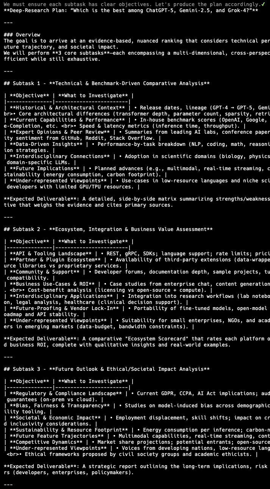

# gllm - Golang Command-Line LLM Companion

`gllm` is a powerful CLI tool designed to interact seamlessly with various Large Language Models (LLMs). It supports features like interactive chat, multi-turn conversations, file attachments, search integration, a command agent, multi-agent workflows, deep research, and extensive customization.

## 🚀 Features

- **Flexible Model Selection**: Easily configure and switch between different LLMs.
- **Interactive Chat Mode**: Start real-time conversations with AI models.
- **Prompt Templates & System Prompts**: Manage reusable prompts and instructions.
- **Attachment Support**: Process files, images, and URLs as part of your queries.
- **Search Integration**: Use search engines to find the latest and most relevant information.
- **PDF & Image Processing**: Supports processing of PDF documents and images with capable models.
- **Reasoning & Deep Thinking**: Generate detailed explanations, logical breakdowns, and step-by-step analysis.
- **Markdown Support**: Renders Markdown for easy-to-read formatted output.
- **Multi-turn Conversations**: Engage in multiple rounds of conversation and manage chat history.
- **Command Agent Mode**: Let LLMs plan and execute commands with your confirmation.
- **Multi-Agent Workflows**: Build and run complex workflows with multiple agents for tasks like deep research.
- **Token Usage Tracking**: Monitor your token consumption.
- **Configuration Management**: Easily manage models, templates, system prompts, and search engines.
- **Version Control**: Easily track and update your `gllm` setup.

---

## 📌 Installation

### Homebrew (macOS)

```sh
brew tap activebook/gllm
brew install gllm
```

### Build from Source

```sh
git clone https://github.com/activebook/gllm.git
cd gllm
go build -o gllm
```

---

## 🎯 Usage

### Basic Commands

- **Ask a simple question:**
  ```sh
  gllm "What is Go?"
  ```
  

- **Use a specific model:**
  ```sh
  gllm "Where is the best place to visit in London?" -m gpt4o
  ```

- **Use a template for a specific task:**
  ```sh
  gllm "How to find a process and terminate it?" -p shellmate
  ```

- **Search the web:**
  ```sh
  gllm "Who is the current POTUS?" -s
  ```
  

### Interactive Chat

Start an interactive chat session:

```sh
gllm chat
```


Within the chat, you can use various commands:

- `/help`: Show available commands.
- `/history`: View conversation history.
- `/system <prompt>`: Change the system prompt.
- `/attach <file>`: Attach a file to the conversation.
- `! <command>`: Execute a shell command.

### Multi-turn Conversations

- **Start or continue a named conversation:**
  ```sh
  gllm "Who's the POTUS right now?" -c my_convo
  gllm "Tell me more about his policies." -c my_convo
  ```
  

### File Attachments

- **Summarize a text file:**
  ```sh
  gllm "Summarize this" -a report.txt
  ```

- **Analyze an image:**
  ```sh
  gllm "What is in this image?" -a image.png
  ```

- **Process a PDF document (with a capable model like Gemini):**
  ```sh
  gllm "Summarize this PDF" -a document.pdf
  ```
  

### Multi-Agent Workflows (Deep Research)

`gllm` allows you to define and run complex workflows with multiple agents. This is useful for tasks like deep research, where you can have a planner agent, a dispatcher agent, and multiple worker agents to carry out sub-tasks.

- **List available workflows:**
  ```sh
  gllm workflow list
  ```

- **Start a workflow:**
  ```sh
  gllm workflow start "Research the latest advancements in AI."
  ```

Here's an example of a deep research workflow in action:

1.  **Planner:** Designs a plan for the research.
    
2.  **Dispatcher:** Dispatches sub-tasks to worker agents.
    
3.  **Workers:** Execute the sub-tasks in parallel.
    
4.  **Summarizer:** Summarizes the results from the workers to provide a final report.
    

---

## 🛠 Configuration

`gllm` stores its configuration in a user-specific directory. You can manage the configuration using the `config` command.

- **Show the configuration file path:**
  ```sh
  gllm config path
  ```

- **Print all configurations:**
  ```sh
  gllm config print
  ```
  

- **Manage models, templates, system prompts, and search engines:**
  ```sh
  gllm model --help
  gllm template --help
  gllm system --help
  gllm search --help
  ```

---

## 🏗 Contributing

Contributions are welcome! Please feel free to submit a pull request or open an issue.

---

*Created by Charles Liu ([@activebook](https://github.com/activebook))*