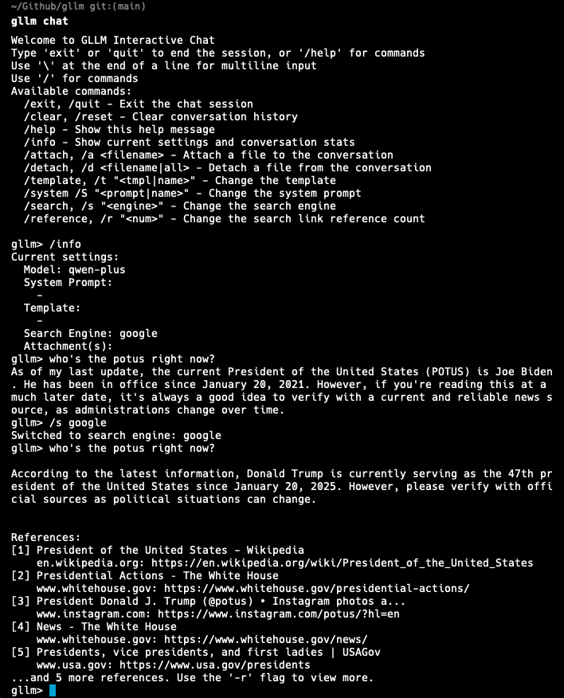
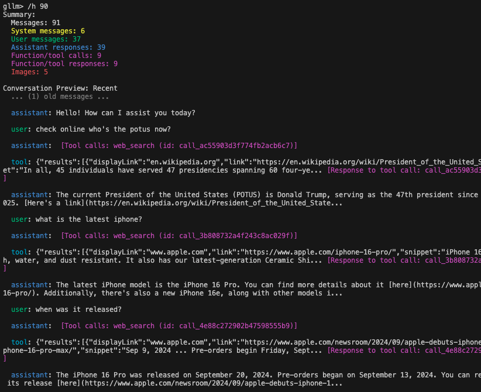
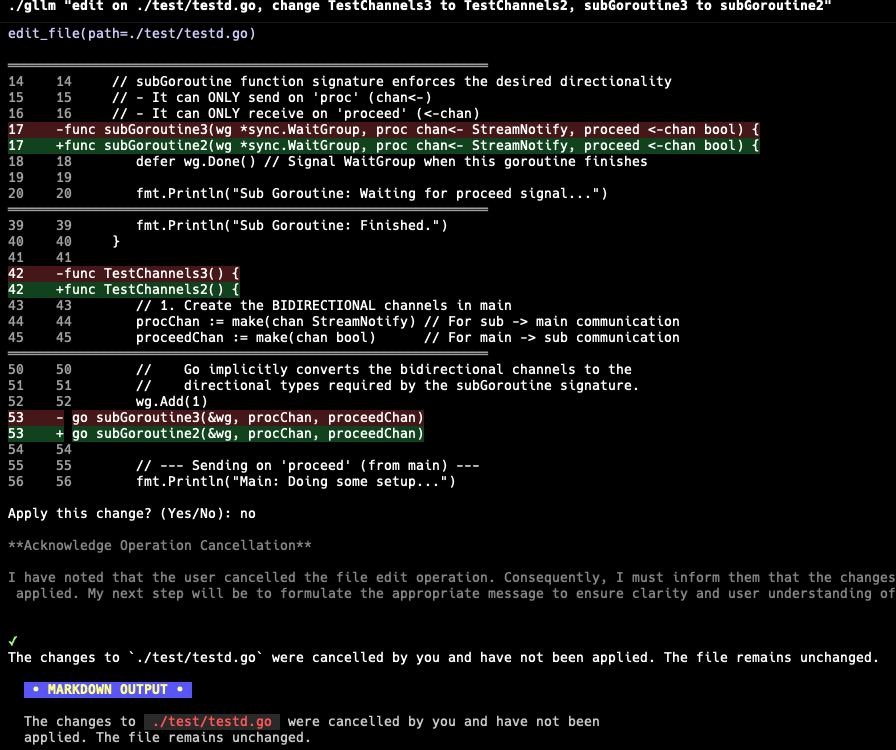

# gllm - Golang Command-Line LLM Companion

`gllm` is a powerful CLI tool designed to interact seamlessly with various Large Language Models (LLMs). It supports features like interactive chat, multi-turn conversations, file attachments, search integration, a command agent, multi-agent workflows, deep research, mcp services and extensive customization.

## 🚀 Features

- **Flexible Model Selection**: Easily configure and switch between different LLMs.
- **Multi-API compatibility**: Compatible with OpenAI API, Anthropic API, and Google Gemini API.
- **Interactive Chat Mode**: Start real-time conversations with AI models.
- **Editor Integration**: Use your preferred text editor for comfortable multi-line input in chat mode.
- **Prompt Templates & System Prompts**: Manage reusable prompts and instructions.
- **Attachment Support**: Process files, images, and URLs as part of your queries.
- **Search Integration**: Use search engines to find the latest and most relevant information.
- **Web Retrieval**: Extract comprehensive text content from URLs, including websites, raw text files, and PDF documents.
- **PDF & Image Processing**: Supports processing of PDF documents and images with capable models.
- **Reasoning & Deep Thinking**: Generate detailed explanations, logical breakdowns, and step-by-step analysis.
- **Markdown Support**: Renders Markdown for easy-to-read formatted output.
- **Multi-turn Conversations**: Engage in multiple rounds of conversation and manage chat history.
- **Command Agent Mode**: Let LLMs plan and execute commands with your confirmation.
- **Model Context Protocol (MCP) Support**: Connect to external MCP servers to access additional tools and data sources.
- **Token Usage Tracking**: Monitor your token consumption.
- **Configuration Management**: Easily manage models, templates, system prompts, and search engines.
- **Memory Management**: Remember important facts about you across sessions for personalized responses.
- **Context-Aware Agent Switching**: Agents can hand off tasks to other specialized agents with full context and instructions across different LLM providers.
- **Agentic Workflow**: Orchestrate sophisticated multi-agent behaviors using state-of-the-art models for parallel task execution and save context window.
- **Agent Skills**: Support agent skills, switch skills on and off, and install from git or local path.
- **@ Reference Support**: Reference files and directories directly in prompts using @ syntax for seamless context inclusion.
- **Colorful Themes**: Supports hundreds of popular themes, compatible with light and dark modes, ANSI-color, and full true-color.
- **Cross-platform Support**: gllm is available for macOS, Windows, and Linux, and easy to install and update.

---

## 📌 Installation

### Homebrew (macOS)

```sh
brew tap activebook/gllm
brew install gllm --cask
```

```sh
brew update
brew upgrade gllm --cask
```

### Scoop (Windows)

```sh
scoop bucket add gllm https://github.com/activebook/scoop-gllm.git
scoop install gllm
```

### Shell (Alpine Linux/Ubuntu/CentOS/MacOS)

```sh
curl -fsSL https://raw.githubusercontent.com/activebook/gllm/main/build/install.sh | sh
```

### Build from Source

```sh
git clone https://github.com/activebook/gllm.git
cd gllm
go build -o gllm
```

#### eg. Run on Alpine Linux

| Run on Linux | MCP Run on Linux |
|--------------|------------------|
|  |  |

---

## 💡 Initialization

The easiest way to get started is to run the interactive initialization wizard:

```sh
gllm init
```

This will guide you through setting up your preferred LLM provider, API keys, and default settings.

## 🎯 Usage

### Basic Commands

- **Ask a simple question:**

  ```sh
  gllm "What is Go?"
  ```

- **Use a specific model:**

  ```sh
  gllm "Where is the best place to visit in London?" -m gpt4o
  ```

- **Use a template for a specific task:**

  ```sh
  gllm "How to find a process and terminate it?" -p shellmate
  ```

- **Search the web:**

  ```sh
  gllm "Who is the current POTUS?" -s
  ```

  

- **Reference files in prompts:**

  ```sh
  gllm "Give me an overview of the project structure: @cmd/ and @service/"
  gllm "I'm considering refactoring this code. Analyze the current structure and suggest improvements: @service/agent.go @service/openai.go"
  gllm "Document this new feature based on the code: @service/atref.go and @test/test_atref.go"
  ```

### Interactive Chat

Start an interactive chat session:

```sh
gllm chat
```



Within the chat, you can use various commands:

- `/help`: Show available commands.
- `/history`: View conversation history.
- `/system <prompt>`: Change the system prompt.
- `/attach <file>`: Attach a file to the conversation.
- `! <command>`: Execute a shell command.

### Multi-Line Input with Editor

For longer messages or code snippets, use your preferred text editor directly in chat mode:

```sh
# In chat mode, type:
/editor
/e
```

#### ✨ In chat mode, you can copy/paste text/code

**How to use:**

1. Open prefered editor
2. Compose your message
3. Save and exit the editor
4. Review the content in gllm
5. Press Enter to send or Ctrl+C to discard

**Setup your editor:**

```sh
# Set your preferred editor (vim, nano, code, etc.)
gllm editor vim

# List available editors
gllm editor list

# Check current editor
gllm editor
```

### Multi-turn Conversations

There are two main ways to have a multi-turn conversation:

#### 1. Single-Line Style (using named conversations)

You can maintain a conversation across multiple commands by assigning a name to your conversation with the `-c` flag. This is useful for scripting or when you want to continue a specific line of inquiry.

- **Start or continue a named conversation:**

  ```sh
  gllm "Who's the POTUS right now?" -c my_convo
  gllm "Tell me more about his policies." -c my_convo
  ```

- **Conversation Management:**

  ```sh
  gllm convo list
  gllm convo info my_convo
  gllm convo remove my_convo
  ```

#### 2. Chat Style (interactive session)

For a more interactive experience, you can use the `chat` command to enter a real-time chat session.

- **Start an interactive chat session:**

  ```sh
  gllm chat
  ```

  Within the chat, the conversation history is automatically maintained.

- **Check chat history:**

  ```sh
  in chat mode, type: /history or /h
  ```

  

---

## Memory Management

`gllm` can remember important facts about you across sessions, making conversations more personalized and contextual.

### Memory Commands

```sh
gllm memory
gllm memory add "I prefer Go over Python"
gllm memory list
gllm memory clear --force  # Skip confirmation
gllm memory path
```

### How Memory Works in Conversations

Memories are automatically injected into the system prompt, so the LLM will remember your preferences and context across all conversations:

**Example:**

```sh
# Start a conversation - the LLM will automatically consider your memories
$ gllm chat
> Remember this: I work primarily with Go and Docker
> Forget this: I love dark jokes
```

You can manually edit this file or use the `gllm memory path` command to find it.

---

### File Attachments

- **Summarize a text file:**

  ```sh
  gllm "Summarize this" -a report.txt
  ```

- **Analyze an image:**

  ```sh
  gllm "What is in this image?" -a image.png
  ```

- **Process a PDF document (with a capable model like Gemini):**

  ```sh
  gllm "Summarize this PDF" -a document.pdf
  ```

### Code Editing

The command agent supports diff editing for precise code modifications.

```sh
gllm "Read this file @build.sh and change function name"
```

| Edit code with diff | Cancel an edit |
|:-------------------:|:--------------:|
|  |  |

### Agentic Workflows

`gllm` introduces a powerful **Agentic Workflow** system that leverages **Agent Tools** and **State Tools** to orchestrate complex, multi-agent tasks. This approach solves the traditional context window limitations by decoupling agent execution and using a shared state memory. SOTA LLMs like Gemini 3.0 and GPT-5.2 can handle complex workflows with ease.

#### How it Works

1.  **Agent Tools (`call_agent`)**:
    - An Orchestrator agent can spawn independent sub-agents using the `call_agent` tool.
    - Each sub-agent runs in its own isolated context, preventing the "context window explosion" typical of long chains.
    - Sub-agents can run in parallel, maximizing efficiency.

2.  **State Tools (`set_state`, `get_state`)**:
    - Instead of passing massive context strings, agents communicate via a high-speed, in-memory **Shared State**.
    - An agent writes its output to a specific key in the shared state (e.g., `set_state(key="research_report", value="...")`).
    - The next agent reads that key (e.g., `get_state(key="research_report")`) to continue the work.
    - This keeps the communication channel lightweight while preserving the full depth of data in memory.

#### Deep Research Workflows

Build complex workflows where agents collaborate autonomously.

| **GPT-5.2 Workflow** | **Gemini 3.0 Workflow** |
|:---:|:---:|
|  | <br><br> |

| **DeepSeek V3.2 Workflow** | **Qwen Workflow** | **LongCat Workflow** |
|:---:|:---:|:---:|
| <br><br> |  | <br><br> |

#### Recursive LM Workflows

Recursive LM (RLM) instructs the LLM to act as a programmer managing large datasets, using code to extract info from files snippet-by-snippet (not loading entire files), verify with code, and filter through chunks or regex while considering context window. It treats the LLM as an OS dispatching tasks to subagents (processes) with coding abilities. Subagents critique their work, save to shared memory state. Root LLM uses a judge agent to evaluate combined results from shared memory. If good, job done; else, try again with new approaches.

| RLM DeepSeek Task | RLM Subagent Task 1-2 |
|----------------|----------------|
|  |  |

| RLM Subagent Task 3-4 | RLM Judge & Summary |
|----------------|----------------|
|  |  |

---

## 🧠 Agent Skills

Agent Skills are a lightweight, open format for extending AI agent capabilities with specialized knowledge, specialized tools, and advanced workflows. Skills are encapsulated in directories containing a `SKILL.md` file with metadata and instructions.

| Arxiv Skill Search Paper | YouTube Download Skill |
|--------------------------|------------------------|
|  |  |

### Managing Skills

You can manage skills using the `gllm skills` command:

- **List installed skills:**

  ```sh
  gllm skills list
  ```

- **Install a skill from a local path:**

  ```sh
  gllm skills install ./path/to/skill
  ```

- **Install a skill from a Git repository:**

  ```sh
  gllm skills install https://github.com/user/skill-repo.git
  # Or specify a subdirectory within the repo
  gllm skills install https://github.com/user/skill-repo.git --path sub/dir
  ```

- **Enable/Disable skills interactively:**

  ```sh
  gllm skills switch
  ```

- **Uninstall a skill:**

  ```sh
  gllm skills uninstall skill-name
  ```

### Skill Format

A skill is a directory containing a `SKILL.md` file. The file must start with YAML frontmatter:

```markdown
---
name: My Skill
description: This skill does awesome stuff.
---

Detailed instructions for the agent go here...
```

You can also include a `scripts/` directory for helper scripts and a `resources/` directory for additional data files that the skill may reference.

---

## 🎨 Themes

`gllm` supports hundreds of popular themes, compatible with light and dark modes, ANSI-color, and full true-color.

### Manage Themes

- **Show current theme and samples:**

  ```sh
  gllm theme
  ```

- **Switch to a different theme:**

  ```sh
  gllm theme switch
  ```

| Light mode VSCode Theme | Dark mode Dracula Theme |
|:---:|:---:|
|  |  |

---

## 🤖 Agent Management

Create and manage multiple AI assistant profiles with different configurations:

```sh
# Create agents for different tasks
gllm agent add coder --model gpt-4o --tools on
gllm agent add researcher --model gemini-pro --search google

# Switch between agents
gllm agent switch coder
gllm agent switch researcher

# List and manage agents
gllm agent list
gllm agent info coder
gllm agent set coder --model gpt-4
```

**Agent Commands:**

- `gllm agent add <name>` - Create a new agent
- `gllm agent list` - List all agents
- `gllm agent switch <name>` - Manual switch to an agent
- `switch_agent` tool - Autonomous handover between agents with context-aware "briefing" instructions.
- `gllm agent info <name>` - Show agent details
- `gllm agent set <name>` - Update an agent
- `gllm agent remove <name>` - Delete an agent

---

## 🛠 Model Context Protocol (MCP)

`gllm` supports the Model Context Protocol (MCP), allowing you to connect to external MCP servers to access additional tools and data sources. This enables LLMs to interact with external services, databases, and APIs through standardized protocols.

### Enabling/Disabling MCP

- **Enable MCP:**

  ```sh
  gllm mcp on
  ```

- **Disable MCP:**

  ```sh
  gllm mcp off
  ```

- **Check MCP status:**

  ```sh
  gllm mcp
  ```

### Managing MCP Servers

You can add, configure, and manage MCP servers of different types:

- **Add an MCP server:**

  ```sh
  # Add a stdio-based server
  gllm mcp add --name my-server --type std --command "my-mcp-server"

  # Add an SSE-based server
  gllm mcp add --name sse-server --type sse --url "http://example.com/mcp"

  # Add an HTTP-based server
  gllm mcp add --name http-server --type http --url "http://example.com/mcp"
  ```

- **List available MCP tools:**

  ```sh
  gllm mcp list
  ```

  

- **Update an MCP server:**

  ```sh
  gllm mcp set --name my-server --allow true
  ```

- **Remove an MCP server:**

  ```sh
  gllm mcp remove --name my-server
  ```

- **Export/Import MCP servers:**

  ```sh
  gllm mcp export [path]
  gllm mcp import [path]
  ```

### Using MCP in Queries

Once MCP is enabled and servers are configured, the LLM can automatically use available MCP tools during conversations:

```sh
gllm "Use the available tools to fetch the latest info of golang version"
```


The LLM will detect relevant MCP tools and use them to enhance its responses with external data and capabilities.

---

## 🛠 Configuration

`gllm` stores its configuration in a user-specific directory. You can manage the configuration using the `config` command.

- **Show the configuration file path:**

  ```sh
  gllm config path
  ```

- **Print all configurations:**

  ```sh
  gllm config print
  ```

- **Export/Import the configuration file:**

  ```sh
  gllm config export [directory]
  gllm config import [directory]
  ```

- **Manage models, templates, system prompts, and search engines:**

  ```sh
  gllm model --help
  gllm template --help
  gllm system --help
  gllm search --help
  ```

---

## 🏗 Contributing

Contributions are welcome! Please feel free to submit a pull request or open an issue.

---

```
{
  "author": {
    "name": "Charles Liu",    
    "url": "https://github.com/activebook",
    "page": "https://activebook.github.io"
  }
}
```
